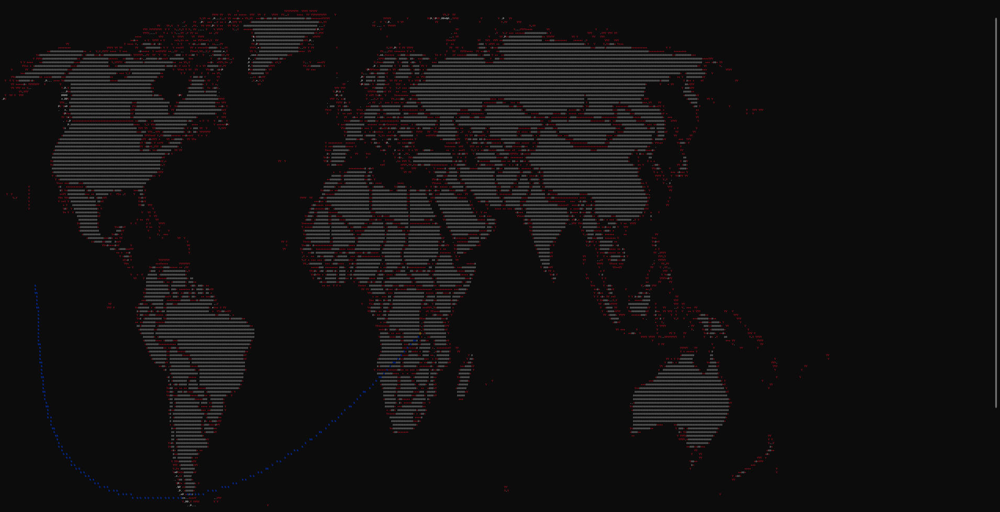
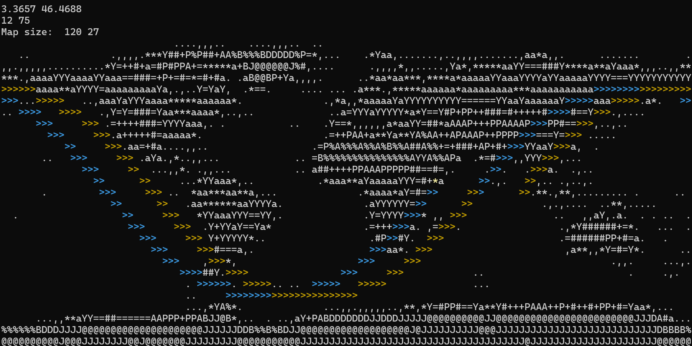
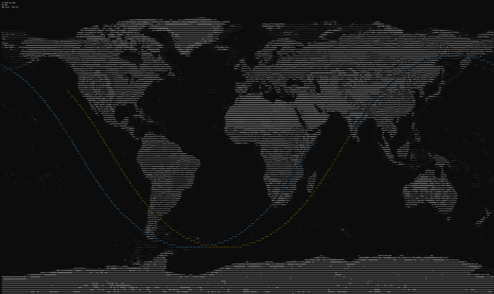
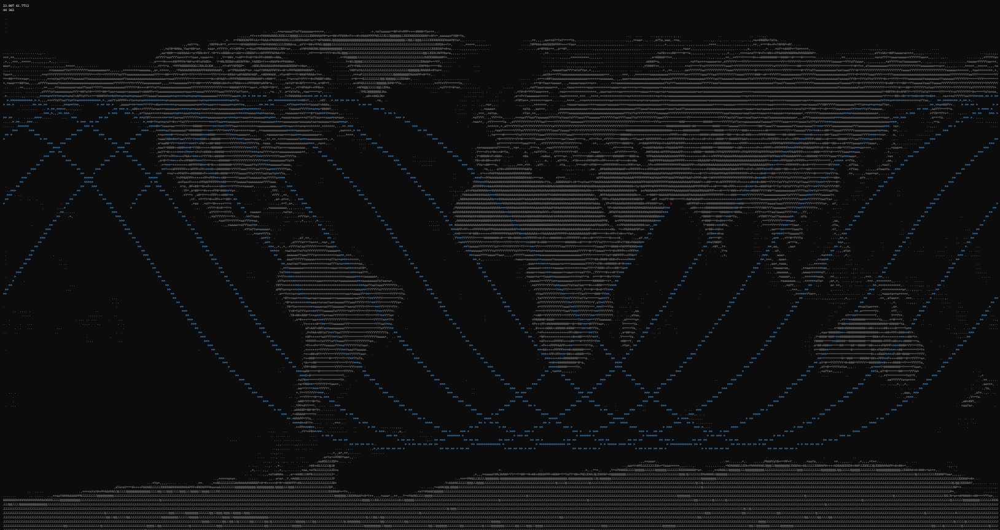

# ISS Real Time Tracking
- First Attempt: Cartesian Coordinates(笛卡爾座標)  
  

The trajectory was strange, so I changed to a [better world map](https://www.joaoleitao.com/wp-content/uploads/2019/04/World-Map.jpg) and use Mecator Projection instead

### Result


##### result with different map width (120 and 540)  


  

##### Trajectory for 7 hrs
  

### Mecator Projection
It is impossible to create a 100% precise 2D map . It will have some error regardless.

My convertion works well to about latitude between ±70°.  

#### Convert from (latitude, longitude)
> Convert geographic coordinates into pixel coordinates on my 2D map
1. Get radians from degrees
```python
longitude_rad = lon * math.pi / 180
latitude_rad = lat * math.pi / 180
```
2. Get scale factor to fit my map size
```python
x_scale = map_width / 2 / math.pi
y_scale = map_height / 2 / math.pi
```  
The longitude scales ranges between ± $pi$  

For the latitude part:  

Theoretically, Mercator projection can range from $-infinity$ to $+infinity$, maps usually cut of around 85°. This is why places near poles will have distortions.  
Numbers range around 3~4 can substitute pi for better fitting different latitude or maps. Here I use pi for general.  


3. Get x, y coordinates on 2D map using Mercator projection
```python
x = map_width / 2 + x_scale * longitude_radians
y = map_height / 2 - y_scale * math.log((1 + math.sin(latitude_radians)) / (1 - math.sin(latitude_radians)))
```  
map_width(map_height) / 2 centers the map around latitude/longitude = 0  

In my source code are some commented-out lines. I tried to calculate the y coordinates by taking into account the distortion of the Mercator projection, instead of using a constant scale factor($pi$), to get a more accurate map, but the result did not work well for my map.  

### Params
- MAP_Width: My preference is around 540
- MAP_Height: `int(ratio * MAP_Width * 0.4)`, you can change the number to anything you like
- call_freq: by default the app will send request to the API endpoint every 10 seconds.  
- history_queue_max_size: modify this to show longer/shorter trajectory (default 3 hrs).

### Build
1. Create virtual env  
\>`python -m venv env`
2. Get in the env  
\>`.\env\Scripts\activate`  
3. Install dependencies  
\>`pip install -r requirements.txt`

Steps 1 and 2 may vary on differnt OS  

